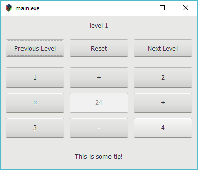

# GTK 24 game
This is a simple 24 game which build on GTK+3.0.

### How to run it
1. git clone https://github.com/liudonghua123/gtk-game-24.git
2. cd gtk-game-24
3. make main
4. make run_main

### Prerequisites
- Windows environment
    1. install MSYS2
    2. install gtk3+ libraries, see [https://gtk.org/download/windows.php](https://gtk.org/download/windows.php)
    3. install libyaml via `pacman -S mingw-w64-i686-libyaml` (not `libyaml` because this package doesn't include `yaml.h`)
- Linux/Unix
    1. install gtk3+ libraries, see releated documentation
    2. install libyaml-dev
- MacOS
    1. install brew
    2. install gtk3+ libraries via `brew install gtk+3`
    3. install libyaml via `brew install libyaml`

### Next steps
- [ ] Refact and improve code, make it clean, clear and more readable.
- [ ] Add css and/or theme features, make it look nicer.
- [ ] Add level data editor, current the game data is store in a yaml file named `game-data.yaml`

### Some snapshot

### LICENSE
[MIT](LICENSE) License

Copyright (c) 2018 liudonghua